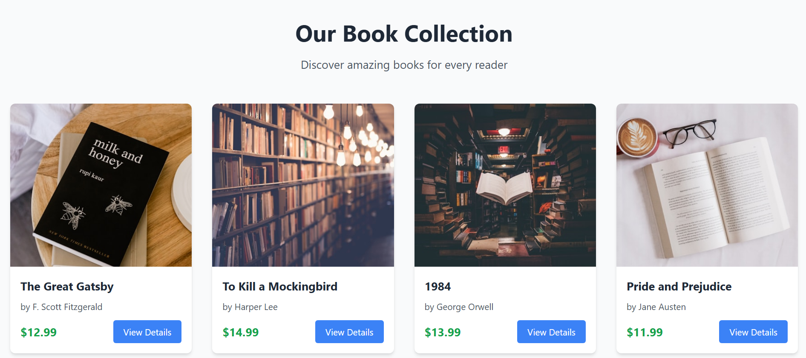
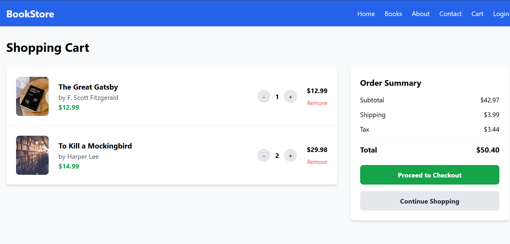

# 📚 **Online Bookstore — React Application**

A modern, responsive online bookstore built using **React**, **Vite**, and **Tailwind CSS**.
Users can browse books, view details, authenticate, and manage their shopping cart through a clean and intuitive UI.

---


## 📸 **Screenshots**


* **Home Page**
  

* **Books Catalog**
  


* **Shopping Cart**
  

* **Login / Auth Pages**
  

---

## 🛠 **Tech Stack**

* **React 18**
* **Vite**
* **Tailwind CSS**
* **React Router DOM**
* **React Icons**

---

## 📁 **Project Structure**


src/
├── components/           
│   ├── Header.jsx       
│   ├── Footer.jsx       
│   └── BookCard.jsx     
│
├── pages/
│   ├── Home.jsx         
│   ├── About.jsx        
│   ├── Books.jsx        
│   ├── BookDetails.jsx  
│   ├── Contact.jsx      
│   ├── Cart.jsx         
│   ├── Login.jsx        
│   ├── Register.jsx     
│   └── Profile.jsx      
│
├── router/
│   └── AppRouter.jsx    
│
└── styles/
    └── index.css        
```

---

```
## ⚙️ **Setup & Installation**

### **Prerequisites**

* Node.js 14+
* npm or yarn

### **Steps**


# Clone repository
git clone [Link](https://github.com/Abdallah-khatib-7/book_store.git)
cd online-bookstore

# Install dependencies
npm install

# Start development server
npm run dev


Visit:
👉 **[http://localhost:5173](http://localhost:5173)**

### **Build for Production**

```bash
npm run build
```

---

## 🎯 **Features**

### ✔ Completed

* Responsive UI (mobile → desktop)
* Book catalog with images & search
* Individual book detail pages
* Shopping cart with quantity management
* User authentication pages (login/register)
* Contact page
* Profile page
* Modern, clean UI with Tailwind

### 📄 Pages Included

* Home
* About
* Books
* Book Details
* Contact
* Cart
* Login
* Register
* Profile

---

## 🎨 **Design Highlights**

* Mobile-first responsive layout
* Clean, modern Tailwind-based UI
* Smooth transitions & hover animations
* Semantic HTML + accessibility tags
* Optimized component structure

---

## 📱 **Responsive Breakpoints**

* **Mobile:** < 768px
* **Tablet:** 768px – 1024px
* **Desktop:** > 1024px

---

## 🔧 **Customization**

### **Adding Books**

In `src/pages/Books.jsx`:

```javascript
const books = [
  {
    id: 1,
    title: "Book Title",
    author: "Author Name",
    price: 19.99,
    image: "/path/to/image.jpg"
  }
];
```

### **Styling**

Modify Tailwind classes in components or edit global styles in:

```
src/styles/index.css
```

---

## 🤝 **Contributing**

```bash
# Create a feature branch
git checkout -b feature/AmazingFeature

# Commit changes
git commit -m "Add AmazingFeature"

# Push branch
git push origin feature/AmazingFeature
```

Open a pull request.

---

## 📄 **License**

Licensed under the **MIT License**.
See the `LICENSE` file for details.

---

## 👥 **Author**

**Your Name**
[GitHub Profile]  https://github.com/Abdallah-khatib-7/

---

## 🙏 **Acknowledgments**

* Book images via **Unsplash**
* Icons via **React Icons**
* Built using **React**, **Vite**, and **Tailwind CSS**

---


